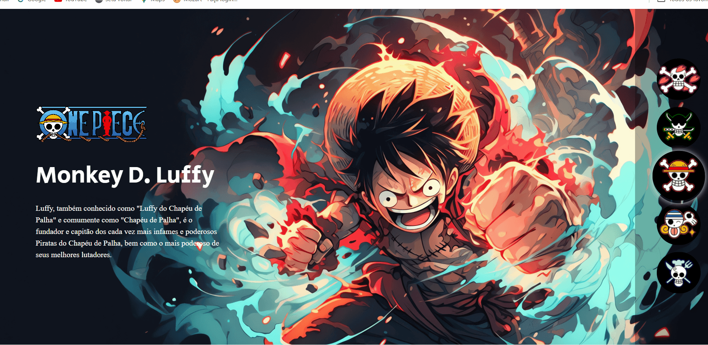

# Projeto One Piece
[]

## Tecnologias utilizadas
- HTML
- CSS
- JS
##  Como utilizar?
Projeto one piece, é uma landing page onde você cliclar, sobre as bandeiras de cada pirata irá mostrar um personagem diferente junto com sua descrição.

## versão mobile
[]

## Link
(https://igorsousasilva.github.io/x-men/)
